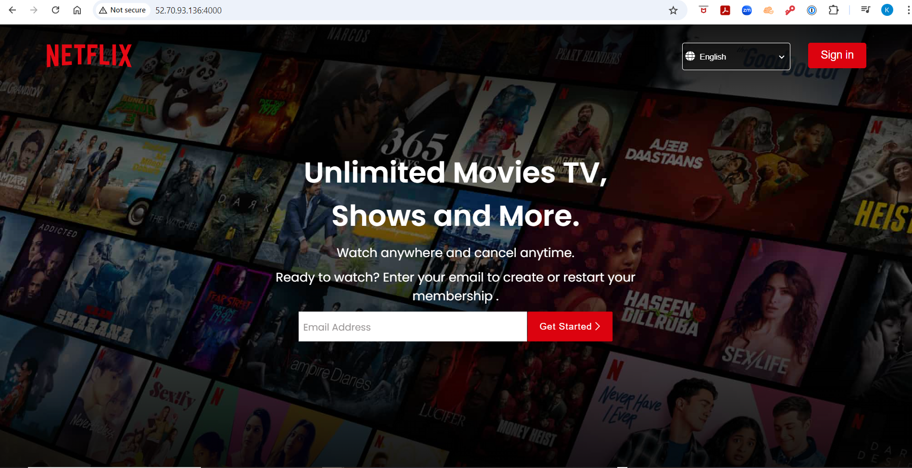
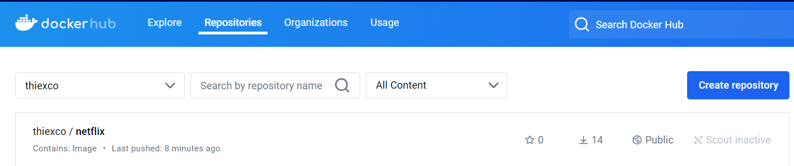
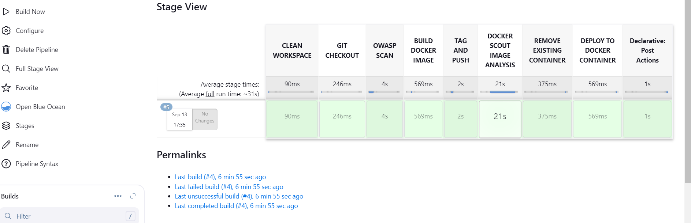

# My Hands-on outcome: successfully deploy Netflix clone









# Deploying Netflix Clone using DevSecOps Approach


# Medium Blog Link:

https://medium.com/@vijaygiduthuri67/deploying-netflix-clone-on-aws-using-devsecops-approach-f299c7375dbc

# Youtube Link
https://www.youtube.com/watch?v=zfwaOb9flG8&t=175s

# **Install Jenkins on Ubuntu:**


```
#!/bin/bash
sudo apt update -y
wget -O - https://packages.adoptium.net/artifactory/api/gpg/key/public | sudo tee /etc/apt/keyrings/adoptium.asc
echo "deb [signed-by=/etc/apt/keyrings/adoptium.asc] https://packages.adoptium.net/artifactory/deb $(awk -F= '/^VERSION_CODENAME/{print$2}' /etc/os-release) main" | sudo tee /etc/apt/sources.list.d/adoptium.list
sudo apt update -y
sudo apt install temurin-17-jdk -y
/usr/bin/java --version
curl -fsSL https://pkg.jenkins.io/debian-stable/jenkins.io-2023.key | sudo tee /usr/share/keyrings/jenkins-keyring.asc > /dev/null
echo deb [signed-by=/usr/share/keyrings/jenkins-keyring.asc] https://pkg.jenkins.io/debian-stable binary/ | sudo tee /etc/apt/sources.list.d/jenkins.list > /dev/null
sudo apt-get update -y
sudo apt-get install jenkins -y
sudo systemctl start jenkins
sudo systemctl status jenkins
```

# **Install Docker on Ubuntu:**


```
# Add Docker's official GPG key:
sudo apt-get update
sudo apt-get install ca-certificates curl
sudo install -m 0755 -d /etc/apt/keyrings
sudo curl -fsSL https://download.docker.com/linux/ubuntu/gpg -o /etc/apt/keyrings/docker.asc
sudo chmod a+r /etc/apt/keyrings/docker.asc
# Add the repository to Apt sources:
echo \
  "deb [arch=$(dpkg --print-architecture) signed-by=/etc/apt/keyrings/docker.asc] https://download.docker.com/linux/ubuntu \
  $(. /etc/os-release && echo "$VERSION_CODENAME") stable" | \
  sudo tee /etc/apt/sources.list.d/docker.list > /dev/null
sudo apt-get update
sudo apt-get install docker-ce docker-ce-cli containerd.io docker-buildx-plugin docker-compose-plugin -y
sudo usermod -aG docker ubuntu
newgrp docker
sudo systemctl status docker
```

# **Install Docker Scout:**


```
docker login       `Give Dockerhub credentials here`
```
```
curl -sSfL https://raw.githubusercontent.com/docker/scout-cli/main/install.sh | sh -s -- -b /usr/local/bin
```

# **Jenkins pipeline**
```
pipeline {
    agent any

    stages {
        stage('CLEAN WORKSPACE') {
            steps {
                cleanWs()
            }
        }
        stage('GIT CHECKOUT') {
            steps {
                git branch: 'main', url: 'https://github.com/vijaygiduthuri/Netflix.git'
            }
        } 
        
        stage('OWASP SCAN') {
            steps {
                dependencyCheck additionalArguments: '--scan ./ --disableYarnAudit --disableNodeAudit', nvdCredentialsId: 'Owasp-API-Key', odcInstallation: 'DP-Check'
                dependencyCheckPublisher pattern: '**/dependency-check-report.xml'
            }
        }
        
        stage('BUILD DOCKER IMAGE') {
            steps {
                sh "docker build -t netflix ."
            }
        }
        
        stage('TAG AND PUSH') {
            steps {
                script {
                    withDockerRegistry(credentialsId: 'docker-cred') {
                        sh "docker tag netflix thiexco/netflix:latest"
                        sh "docker push thiexco/netflix:latest"
                    }
                }
            }
        }
        
        stage('DOCKER SCOUT IMAGE ANALYSIS') {
            steps {
               script {
                   withDockerRegistry(credentialsId: 'docker-cred') {
                      sh "docker-scout quickview thiexco/netflix:latest"
                      sh "docker-scout cves thiexco/netflix:latest"
                      sh "docker-scout recommendations thiexco/netflix:latest"
                   }
               }
            }
        }
        
        stage('REMOVE EXISTING CONTAINER') {
            steps {
                script {
                    // Remove the container if it already exists to avoid name conflicts
                    sh '''
                    if [ "$(docker ps -aq -f name=netflix)" ]; then
                        docker stop netflix
                        docker rm netflix
                    fi
                    '''
                }
            }
        }
        
        stage('DEPLOY TO DOCKER CONTAINER') {
            steps {
                sh "docker run -itd --name netflix -p 4000:80 netflix:latest"
            }
        }
    }
    
    post {
        always {
            emailext attachLog: true,
                subject: "'${currentBuild.result}'",
                body: """
                    <html>
                    <body>
                        <div style="background-color: #FFA07A; padding: 10px; margin-bottom: 10px;">
                            <p style="color: white; font-weight: bold;">Project: ${env.JOB_NAME}</p>
                        </div>
                        <div style="background-color: #90EE90; padding: 10px; margin-bottom: 10px;">
                            <p style="color: white; font-weight: bold;">Build Number: ${env.BUILD_NUMBER}</p>
                        </div>
                        <div style="background-color: #87CEEB; padding: 10px; margin-bottom: 10px;">
                            <p style="color: white; font-weight: bold;">URL: ${env.BUILD_URL}</p>
                        </div>
                    </body>
                    </html>
                """,
                to: 'thiezco@gmail.com',
                mimeType: 'text/html'
        }
    }
}    

```
